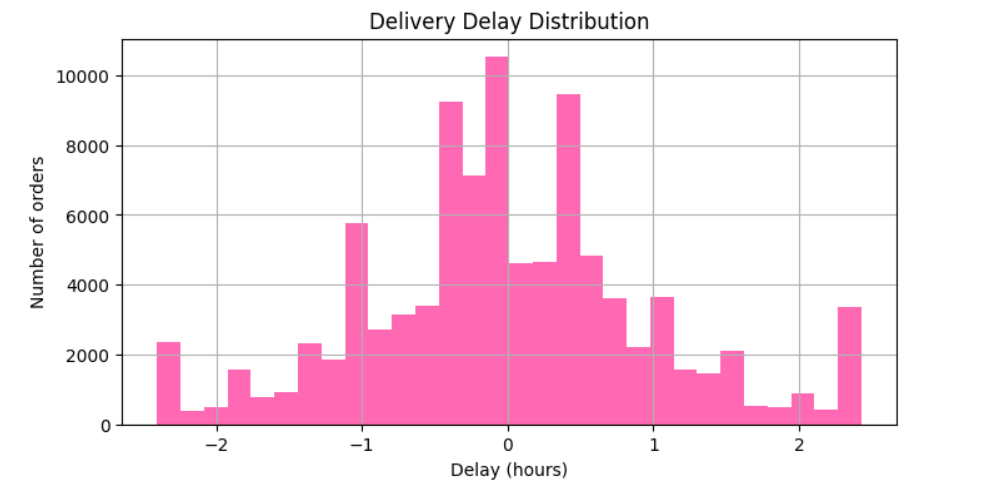
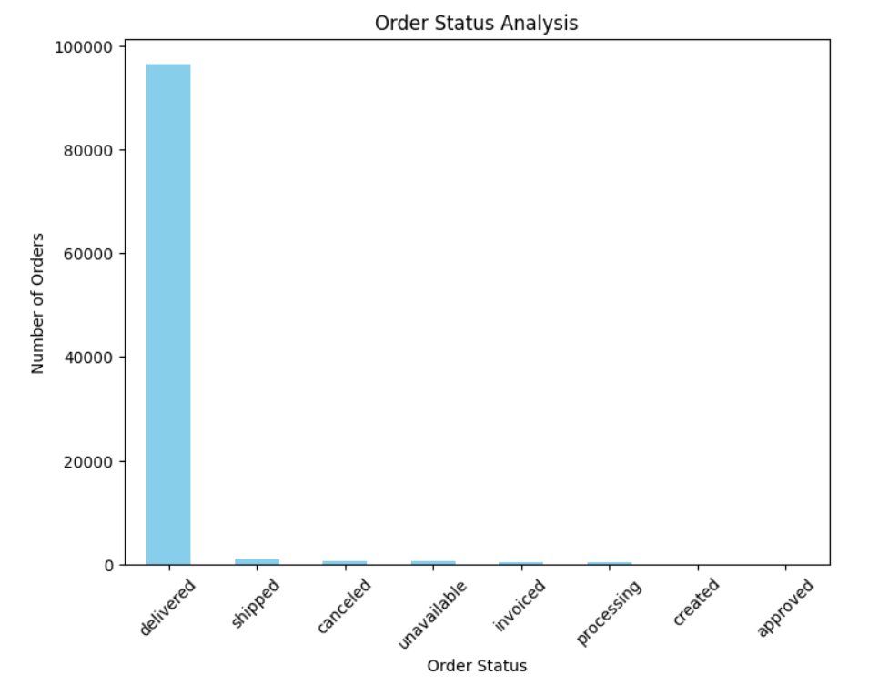
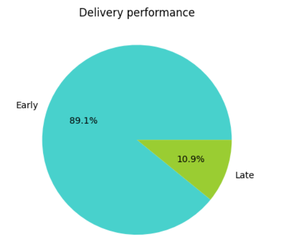
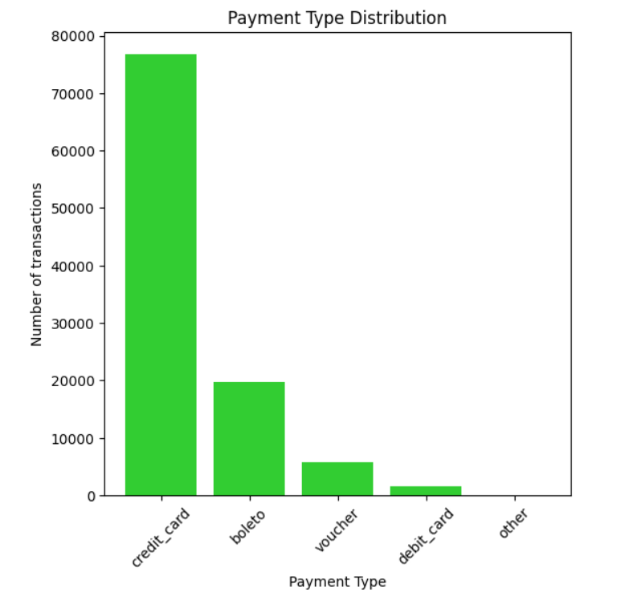
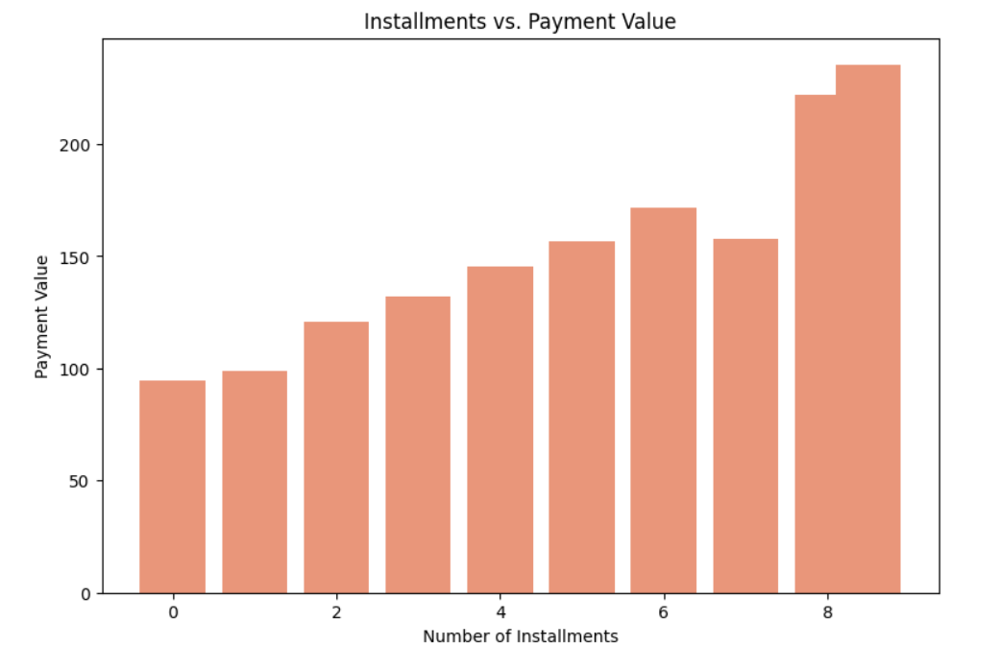
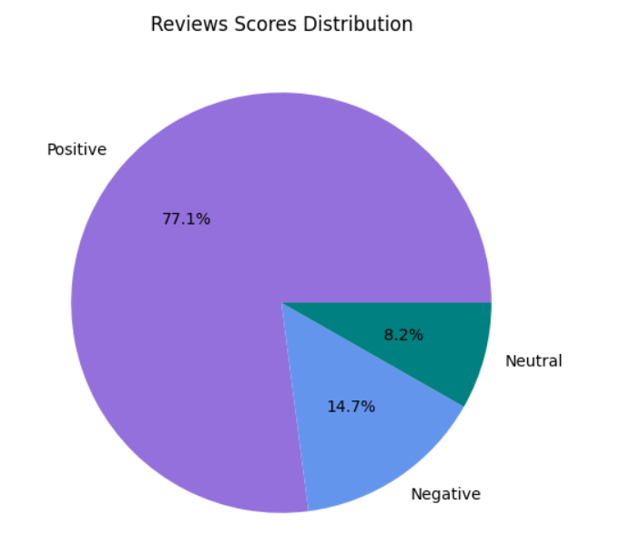
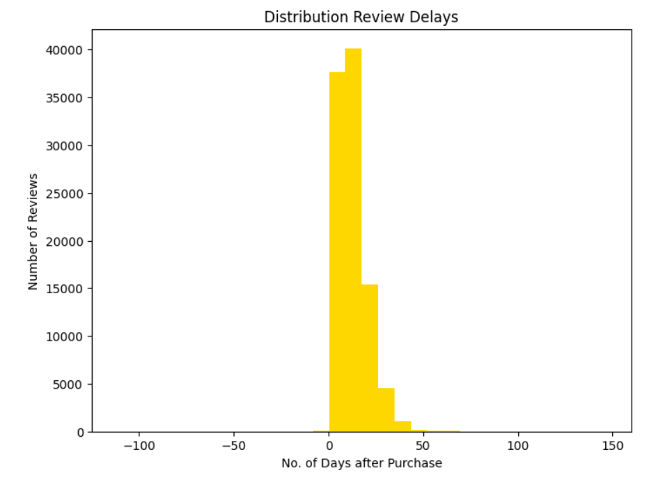
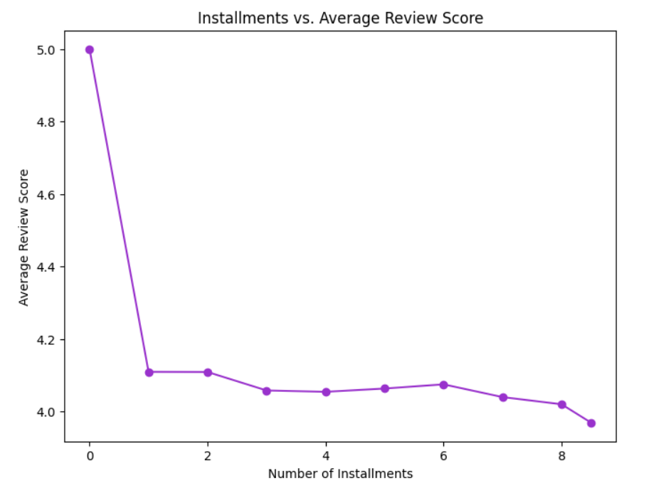

# Insights from Cleaned Olist Data

## Orders Analysis

* **Average Delivery Time**: 11.49 (Calculated from purchase to customer delivery).
* **Proportion of Late Deliveries**: 6.57% of orders delivered after the estimated date.
* **Delivery Delay Distribution**: Histogram of delays.

* **Order Status Analysis**: Distribution of delivered, shipped, canceled, unavailable, etc.

* **Cancellation Rate**: 0.63% of orders canceled.
* **Delivery Performance**: Average actual vs. estimated delivery times.
Average actual delivery time: 11.49 days, Average estimated delivery time: 23.40 days
* **Delivery Performance Categories**: % Delivered Early vs. On Time vs. Late.

* **Median vs. Mean Delivery Delay**: Mean Delivery Delay: -12.09 days, Median Delivery Delay: -12.00 days.

## Payments Analysis

* **Payment Type Distribution**: Distribution of various payment types like Credit card, boleto, etc.

* **Installments vs. Payment Value**: Average payment value across installment counts.

## Reviews Analysis

* **Review Sentiments**: Positive: 77.068048, Negative: 14.688987, Neutral: 8.242965
* **Review Score Distribution**: % of reviews that are 1, 2, 3, 4, 5.

## Cross Analysis (Payments × Reviews)

* **Reviews Timing Distribution**: Distribution of time lag between purchase and review creation.

* **Installments vs. Reviews**: Whether customers paying in more installments leave lower scores.
